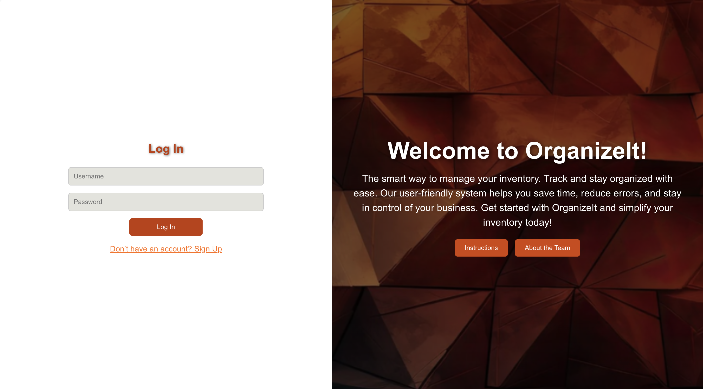

# organize-it-front-end

## OrganizeIt

> OrganizeIt is a inventory management solution designed to help businesses track and manage stock efficiently. With intuitive features and real-time updates, OrganizeIt simplifies inventory control, reduces errors, and boosts productivity.

## Links

***OrganizeIt Link:*** 

***Planning Link:*** [Proposal](https://trello.com/invite/b/66e44ac12dfbd67bdb0cc3d4/ATTI4f9b82867f029411b5b7f336bfaac1a826CFCE5A/final-project)

***Backend Repo:*** [OrganizeIT-backend](https://github.com/RobertAFranco/OrganizeIT-backend/tree/dev)

## Attributions

*(Was used for guidance and explanation)*

[ChatGPT](https://chatgpt.com)

## Technologies Used
- Django
- CSS
- React
- PostgreSQL

## Stretch Goals

- Implement the google maps API

- Add image field

- Search for item

